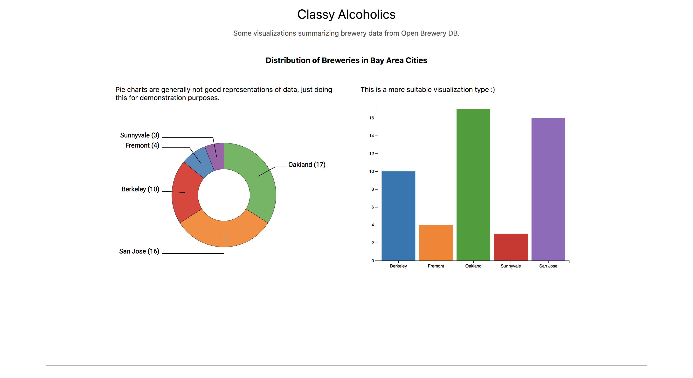

## D3 Mini Project (Example version)

This mini project serves as an intro to working with APIs and creating data visualizations using D3. In a team, you will be creating a single page React app collage that summarizes some aspects of your assigned API in various visual formats. 

You will be pushing code to this repo and testing the page out locally for simplicity. In the end, attach a screenshot of the final page in this README. 

### Page screenshot


### Getting started

Clone the repository and switch to this directory:

```
git clone https://github.com/rlxu/d3-example-brewery.git
cd d3-example-brewery
```

### Code pointers

These are to help you get started. Feel free to move things around or add any files that you think are appropriate. 

`App.js` is the main component for the web page. Currently, the header and box are defined here.

`App.css` contains all current styling.

`DataFetch.js` is used to fetch data from the API using axios. It parses the JSON responses and passes the correct format into the specific visualization components.

`PieChart.js` is the only current visualization component. It creates a pie/donut chart from a dictionary of labels to quantity values. This is the portion that uses D3. Since we are using React (we will be using plain JS for the actual project), there is some overhead to import the necessary functions and to return an svg tag with the node passed in as `ref` for them to show up properly. 

### Testing the page

In the project directory, run:

`npm start`

Runs the app in the development mode.<br>
Open [http://localhost:3000](http://localhost:3000) to view it in the browser.

The page will reload if you make edits.<br>
You will also see any lint errors in the console.
